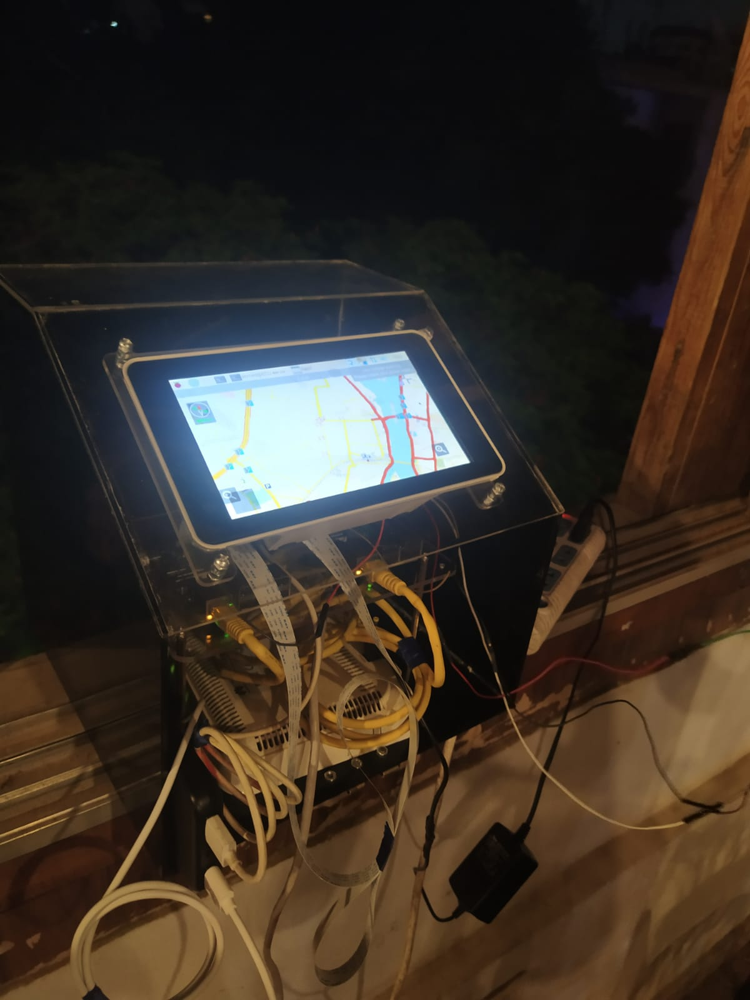
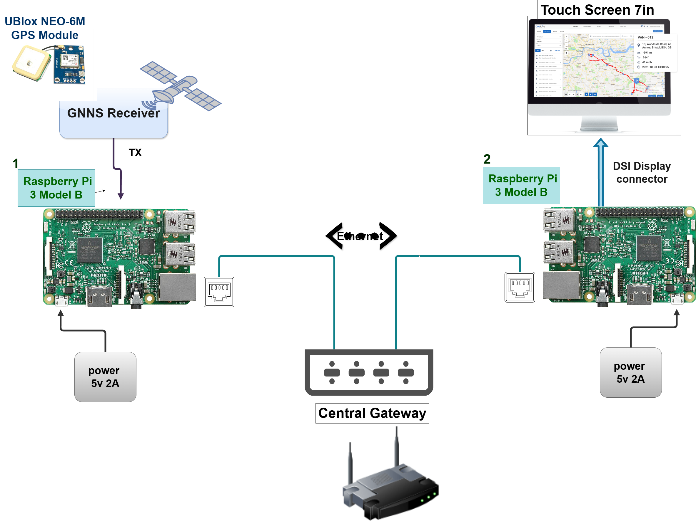

# Adaptive-AUTOSAR

# 🚗 An Infotainment System over the Aaptive AUTOSAR Communication Stack `ara::com`

> **Graduation Project**

---

## 📖 Overview

This project presents the design and implementation of a scalable **infotainment system** built on **Adaptive AUTOSAR** architectural concepts. The system simulates a real-world automotive software environment, enabling distributed inter-process communication, real-time data exchange, and an interactive touchscreen GUI — all running on a **Raspberry Pi** platform.

The project bridges the gap between classical embedded development and modern automotive software engineering, applying industry-standard communication protocols and software architecture patterns used in production vehicles.

---

## ✨ Features

- ✅ **Adaptive AUTOSAR-inspired architecture** with modular, scalable software components
- ✅ **Navigation system** implemented on Raspberry Pi
- ✅ **SOME/IP over Ethernet** for inter-process communication between distributed components
- ✅ **Real-time data exchange** simulating automotive network behaviour
- ✅ **Interactive GUI** optimized for touchscreen HMI displays

---

## 🛠️ Tech Stack

| Category                   | Technologies          |
| -------------------------- | --------------------- |
| **Languages**              | C++, CMake            |
| **Communication Protocol** | SOME/IP over Ethernet |
| **Hardware Platform**      | Raspberry Pi          |
| **Software Architecture**  | Adaptive AUTOSAR      |
| **Interface**              | Touchscreen GUI / HMI |

---

## 🏗️ System Architecture

```
┌──────────────────────────────────────────────────┐
│              Infotainment Application             │
│         (Adaptive AUTOSAR Service Layer)          │
├──────────────┬───────────────────────────────────┤
│  Navigation  │         HMI / GUI Module           │
│   Service    │      (Touchscreen Interface)       │
├──────────────┴───────────────────────────────────┤
│         SOME/IP Communication Middleware          │
│     ara::com  |  Service Discovery (SD)           │
├──────────────────────────────────────────────────┤
│         Execution & State Management              │
│           ara::exec  |  ara::sm                  │
├──────────────────────────────────────────────────┤
│              Raspberry Pi Hardware                │
│          (BSD Socket / Ethernet Layer)            │
└──────────────────────────────────────────────────┘
```

### system testing



### system diagram



---

## 🚀 Getting Started

### Prerequisites

- Raspberry Pi (3B+ or 4 recommended)
- Raspbian / Raspberry Pi OS
- Python 3.x
- CMake
- Ethernet connection between nodes (for distributed setup)

## 📡 Communication Management – `ara::com`

The communication layer is implemented following the **Adaptive AUTOSAR Communication Management** functional cluster (`ara::com`), with the network binding limited to **SOME/IP** over IPv4 Ethernet.

Key implemented capabilities:

- **SOME/IP Service Discovery (SD)** — dynamic detection and registration of available software services over the network
- **Remote Procedure Calls (RPC)** — method invocations across distributed software components
- **Publish/Subscribe Events** — real-time event-driven data exchange between components
- **E2E Communication Protection** — end-to-end data integrity verification on transmitted messages

> Signal-Based and DDS network bindings are out of scope for this project.

---

## ⚙️ Execution & State Management

### Execution Management – `ara::exec`

The **Execution Management** layer is responsible for the lifecycle of Adaptive Applications. It handles:

- Application startup and termination sequencing
- **Function Group** state transitions driven by execution manifests
- Reporting execution state back to the platform via the **Execution Client**

### State Management – `ara::sm`

The **State Management** cluster controls the overall machine state, coordinating the initialization of the **Machine Function Group** and orchestrating transitions between operational modes of the infotainment system.

---

## 🩺 Platform Health Management – `ara::phm`

The system implements **Platform Health Management** to supervise the correct operation of running processes:

- **Alive Supervision** — periodic heartbeat monitoring to confirm a process is still executing
- **Deadline Supervision** — ensures critical tasks complete within their timing constraints

---

## 📝 Log & Trace – `ara::log`

Structured logging is integrated throughout the system using the **Log & Trace** functional cluster:

- Console and file-based log sinks
- Severity-level filtering for runtime diagnostics
- Traceable component-level logging aligned with AUTOSAR logging interfaces

---

## 📊 AUTOSAR Adaptive Platform – Functional Cluster Coverage

| Functional Cluster                              | Status                   |
| ----------------------------------------------- | ------------------------ |
| Communication Management (`ara::com` / SOME/IP) | ✅ Implemented           |
| Execution Management (`ara::exec`)              | ✅ Implemented           |
| State Management (`ara::sm`)                    | ✅ Implemented           |
| Platform Health Management (`ara::phm`)         | ✅ Implemented           |
| Log & Trace (`ara::log`)                        | ✅ Implemented           |
| Core Types (`ara::core`)                        | ✅ Partially implemented |
| Diagnostics (`ara::diag`)                       | ⬜ Out of scope          |
| Persistency                                     | ⬜ Out of scope          |
| Cryptography                                    | ⬜ Out of scope          |
| Time Synchronization                            | ⬜ Out of scope          |

---

_Built with passion for automotive software engineering — where mechanical systems meet intelligent software._
